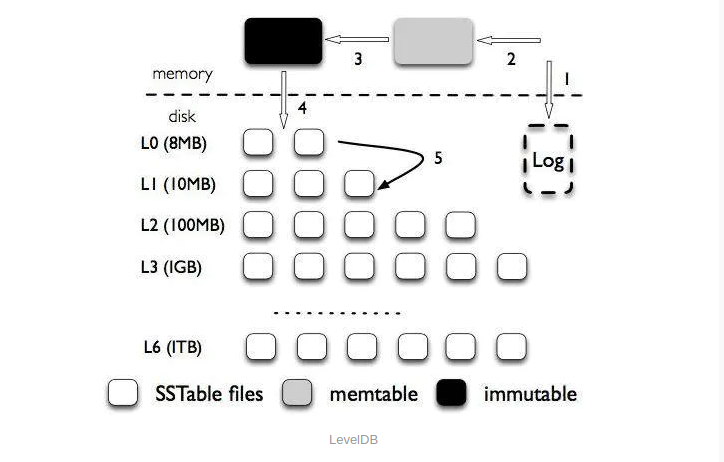
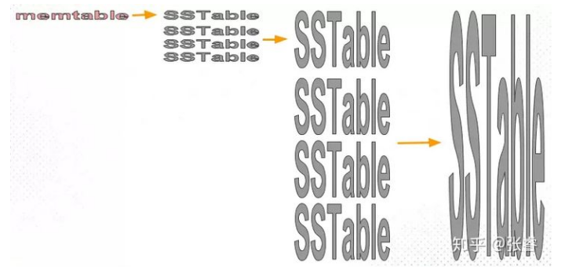

LSM树——不同于B树的数据库组织数据结构。

## 从数据库说起

### 什么是数据库
最基础的层次上来说，数据库只需要做两件事
+ 把数据交给数据库时它负责把数据存起来
+ 从数据库取数据时它将数据返回

### 在linux下模拟一个最简单的数据库
创建以下脚本

```shell
#!/bin/bash
db_set(){
  echo "$1,$2" >> database
}

db_get(){
  grep "^$1," database | sed -e "s/^$1,//" | tail -n 1
}
```
这样我们已经实现了一个简单的数据库，支持存取key-value类型的数据。如下
```shell
source simple_database.sh
db_set name ali
db_get name  
#输出 ali
db_set name bob
db_get name
#输出 bob
```
如上，使用db_set设置一个key-value，使用db_get取出key对应的值。
如果想要更新某个key的value，只需再次调用db_set，新的值会覆盖旧的值。

### 思考
上面这个简单的数据库，支持新增、修改、查询，通过每次将最新的值写入文件末尾，读取文件时从后往前读，这样更新数据后就可以读到
更新后的值。我们可以发现，相比于传统数据库大部分都在使用的B树索引，这个数据库更新数据不需要修改原有的数据，只需要简单的将
新的值写到文件末尾，虽然浪费了一部分存储空间，但是更新简单，特别的，新增和更新操作只需要顺序的写到数据末尾。对于删除操作，
我们同样可以写入一个删除记录，从后往前读取文件时标记了删除的数据不再展示。这样，数据库基本的增删改查功能都可以实现。

*划出重点*：
+ 对空间不敏感
+ 顺序写

**有没有一种特别符合这两种特性的存储介质呢?**

>磁盘顺序读写的性能比随机读写性能高出几个数量级，甚至可以达到内存随机读写的性能。即使是SSD，顺序读写性能也比随机读写高得多。
> 而磁盘价格也比较低，因此对空间并不敏感。


## 日志结构(log-struct)的存储
[上面介绍的这种存储](LSM树.md:16)因为只会向存储设备中追加数据而不会修改，和日志非常相似，因此被称为日志结构的存储。这也
启发了另一种不同于传统B树的数据库存储结构。传统的B树将磁盘分块组织为B树上的节点，数据原地修改，而日志结构的引擎只写文件，
不会更新和删除。下面我们来一步步完善这个数据结构，使其支持完整的增删改查操作。

### 新增和更新操作
上面我们说到这个结构不会修改已写入的数据，所以新增和更新操作都是将数据追加到文件末尾

### 删除操作
因为我们不会修改已写入的文件，对于删除操作，会在文件中写入一个删除标记，读取时进行处理

### 查询操作
上面我们说到，这种数据结构读取数据时是从文件末尾读取开始从后往前读，直到获取到我们需要的值。

## 加快查询速度
上面一节我们提到，查询数据时需要从数据文件末尾从后往前读，如果文件很大而我们要查询的数据恰好位于文件的开头部分，那么每次查询
都需要遍历整个文件，显然这是不可接受的。像其他数据库一样，我们可以通过加索引来加速查找。

### 最简单的索引——哈希索引
说到索引，最简单的就是哈希，内存中维护一个哈希表，保存每个key在磁盘上的位置。新增更新和删除同步更新索引。即使是这么简单的
模型，也已经足够部分情况下的使用，比如Riak数据库（一个高性能的key-value数据库）就以此作为默认的引擎。


>限制：所有key必须都能放进内存，数据库重启后需要重建索引，所以适合key较少的场景。

随着数据不断变化，特别是更新比较多的情况下是，数据文件会不断膨胀，尽管我们只需要最新的值，但旧的值依然保存在数据文件中，我们需要一种
机制来定时清除掉无效的数据，这样不仅可以减少磁盘浪费，也可以加快索引的重建速度。

#### 优化磁盘占用
某一时刻，假定数据文件中写入了1000条记录，由于更新操作比较多，其中有效记录只有100条，那么我们可以重建这部分数据文件。为了简化压缩
操作，我们将之后新的写入操作都重定向到一个新的文件（这样的话内存中的索引需要包含数据所在文件的信息），旧的文件从头读到尾进行压缩。同样，
压缩过程也不会修改旧的文件，而是将记录写入到一个新的文件，压缩完成后，更新内存中索引指向新的文件，旧的文件就可以删除了。就这样，数据文件
达到一定大小后新起一个文件，已经不再写入的文件进行后台压缩（多个压缩后的文件还可以进一步压缩），压缩完成后更新索引。


经过几次压缩操作后，目前有多个数据文件，虽然同一个压缩文件中不存在重复的key（因为经过压缩只会留下一个），但是多个文件还是可能存在重复，
当系统重启后，需要从最新的数据文件开始读取，保证读取到有效的值。考虑到压缩后的文件不会再改变，我们可以为每个压缩文件建立一个索引，并且将
索引持久化，这样可以大大加快重启后恢复内存索引的速度。并且这样也减轻了内存的压力，无需加载所有索引，内存不存在的key扫描磁盘上的索引即可。

### 上面的模型优点
+ 追加写入和压缩操作都是顺序写磁盘，大大提高普通硬盘的效率，即使是SSD，顺序写大部分情况下也优于随机写
+ 因为文件写入后不再修改，这样避免了传统结构修改数据时崩溃导致的恢复数据困难
+ 通过合并压缩旧的数据段，可以避免数据文件随着时间推移而分散的问题。B+树虽然逻辑上相邻的数据连续，但是在两个值之间插入新值，只能在磁盘上分配
  出一块空间，逻辑上连续的文件物理上并不连续，随着时间推移这种情况会更加严重。逻辑上连续的数据分散在磁盘的各个地方，影响读取性能

### 上面的模型存在的问题
上面我们已经理论上总结出了一套可行的方案，但是在实现过程中，还有更多的问题需要考虑：
+ 文本文件不是一个高效的存储格式，使用二进制空间利用更高效
+ 崩溃恢复，内存中的索引需要重建，上面我们提到，可以将压缩文件的索引持久化，减少恢复需要的时间
+ 部分写入。如果写入过程中断电，可能导致数据不完整。BitCask模型通过校验和来检查和忽略损坏的记录
+ 并发控制。这个模型中，数据严格按照顺序写入，因此同时只能有一个写入线程。对于读操作，因为写入的文件可以认为是不变的，因此不需要控制并发

上面这几条算是实现细节，实践中可以优化，最主要的影响使用的是下面的问题：
+ 索引要求可以全部或者大部分放进内存，这在数据量大的时候是不现实的。虽然我们可以在磁盘上维护一个类似的哈希索引，但是哈希表的结构基本上都是
随机I/O，特别是哈希表达到一定大小需要扩容的时候，使用磁盘性能会非常差。并且处理哈希冲突也需要额外的逻辑
+  哈希索引本身的限制——范围查询效率不高

>接下来我们介绍一种没有以上两个限制的数据结构

### SSTable
迄今为止我们的数据结构中，同一个key后面写入的值优先于较早写入的值，不同的key之间的顺序并不重要。

那么现在我们对段文件做一个简单的改变：段文件内的key-value对（每条记录我们简化为一个key-value对）按照key进行排序，这样会带来以下优点：
+ 段合并更加高效，即使段文件很大，我们也可以使用归并排序类似的方式将其合并（需要注意同时出现在两个段文件中的key以较新的为准）
+ 段索引无需保存所有key的位置，可以采用类似跳表的结构，使用二分法找到所属的范围，再顺序查找所需的key。并且正好可以契合磁盘的特性——按块读取，
读取的块中可能包含多个数据。


*这样我们查找handsome时，从索引中可以知道它位于1到1000的位置之间，我们顺序查找这个范围即可。*

**我们把排序后的段称为排序字符串表（Sorted String Table，或者SSTable）。**

接下来我们讨论下具体实现。目前为止，SSTable的数据都位于磁盘上，磁盘上当然可以维护一个有序的数据结构（比如B树），但是在内存中维护一个
有序结果会更简单，选择更多（比如二叉平衡树，红黑树），性能也更好。

优化后整个流程如下：
+ 内存中维护一个有序结构，写入数据时先放入这个结构中，称为内存表
+ 内存表数据量达到一定大小时，将其按顺序写入一个磁盘段。为了避免同步问题，写入磁盘的过程中，其他写操作放入一个新的内存表。旧的内存表
全部写入磁盘后就可以看情况释放掉
+ 读取时还是按照之前的逻辑，从后往前查找，因为现在内存总是维护最新的写操作，所以先在内存中查找，之后按照时间顺序从后往前查找磁盘上的文件。
+ 写入磁盘的段定期进行后台压缩
+ 为了保证内存中的数据不丢失，可以引入WAL（write ahead log）
+ 如果查询的值不存在，我们需要读完所有磁盘上的数据文件才能发现，为了避免这个问题，我们为每个段文件配置一个布隆过滤器，过滤掉不存在的值。

### 写放大和读放大
> 写放大
> 因为磁盘上的数据文件不断被合并，所以一条数据在其生命周期中可能会多次被重新写入磁盘。这种现象称为写放大

> 读放大
> 因为读取数据时需要从后往前读取多个段文件，特别是数据不存在时，可能需要读取所有的段文件。虽然我们上面引入了布隆过滤器，
> 还是有一定概率误判。这种现象称为读放大

### 文件合并策略
>下面是levelDB合并文件的操作

levelDB采用了固定大小的段文件，并且在磁盘上维护了一个多层的数据结构，每一层包含不同数量的段文件，随着层数加深段文件数量也逐渐增多。
每一层数据都是全局有序的（即同一层中，不仅每个段内数据有序，并且前面的段字典序都小于后面的段），并且每层有数据量上限。当某一层数据达
到上限，那么会从这层中选择一个文件合入更高层（图中从上往下看做从低到高）， 并且合并后依然保持更高层的全局有序状态。

>再来看一下另外一种策略

这种策略段文件大小不固定，同样磁盘上维护一个多层的数据结构，但是同一层中的数据并不是全局有序的（每个SSTable内部有序，但是段之间没有关系），当这层数据填满时，将
整层合并成一个更大的SSTable并放入下一层。因此层数越高，段文件也越大。

对比两种策略，第一种每次当前层数据满，会选择一个文件压缩合入更高层，而第二种当前层满后会将当前层全部压缩成一个文件然后直接放入更高层，
因此第一种会更频繁的触发合并操作，因此有更高的[写放大](LSM树.md:147)。而读取时，第一种策略因为是每层全局有序的，可以直接定位到具体文件，
第二种策略则不得不扫描这一层的所有文件，因此第二种策略有更高的[读放大](LSM树.md:150)。因此需要使用场景使用不同的策略。Cassandra就使用了
策略2.

### 简单提一下hbase
hbase同样使用了lsm树，不过hbase使用b+树代替了SSTable。整体还是同样的思想。因此hbase有compaction操作。