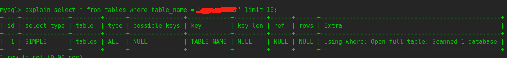
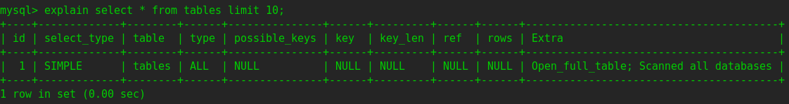

mysql中information_schema这个特殊的数据库相关知识。

### 基本介绍

information_schema提供了访问数据库元数据、mysql服务器状态的查询。例如数据库或者表的名称、
数据列的类型、访问权限等。

information_schema库是SQL标准之一，SQL Server、Oracle均支持，不过表中字段可能有些区别。

每一个MySQL实例都有一个information_schema数据库，用于存放mysql服务器其他数据库的信息。information_schema下面
有多个只读的表，事实上它们都是视图，并不是真正的表，因此不会对应到具体的文件，所以无法使用触发器。同样也没有这个名称的
数据库文件夹（普通的数据库都对应磁盘上的一个文件夹，里面存放数据库里的表文件）。

通过select查询information_schema中的数据可以提供show语句相同的功能（例如show databases，show tables等，都
可以使用select查询information_schema中的数据实现），并且相比于show语句，查询information_schema提供了一个和
普通查询一致的方式来查询数据库的元数据。

> 相比于show，查询information_schema的优点如下
> + 满足[Codd's rule](Codd's rule（科德定律）.md)
> + 只需要了解information_schema中的一些表，就可以用熟悉的select查询替换掉show语句
> + 无需担心增加新的关键字
> + 可以任意筛选、排序、连接、转换字段，相比之下show只能展示固定格式的内容
> + 其他大部分关系型数据库也支持select查询，而show语句其他数据库不一定支持

### 访问权限

每个用户都可以访问information_schema数据库，但是对于表中的数据，如果没有对应的权限，可能只能看到null

### 性能考虑

如果查询语句查询了超过一个数据库，可能会影响性能。可以通过explain查看执行计划。
以查询information_schema中的tables表数据为例：

如下两个执行计划，第一个查询制定了数据库名称，Extra列中提示只扫描一个数据库。第二个查询没有指定数据库，extra
列提示会扫描所有数据库。

### information_schema中的表

这里只列举比较重要的几个表，详细内容可以查看[官方文档](https://dev.mysql.com/doc/refman/5.7/en/information-schema-table-reference.html)

|        表名         |                          功能                          |            常用查询字段             |
|:-----------------:|:----------------------------------------------------:|:-----------------------------:|
| column_privileges |                        数据列的权限                        |                               |
|tables|所有表的信息|                               |
|      columns      |                        每张表中的列                        |                               |
|      engines      |                       存储引擎的属性                        |                               |
|   global_status   |                 全局状态变量，比如线程数、启动时间等信息                 | variable_name,variable_value  |
|global_variables|                     全局系统变量，比如时区                      | variable_name,variable_value  |
|innodb_buffer_page|               innodb buffer pool中的页信息                |                               |
|innodb_buffer_page_lru|               按lru排序的buffer pool中的页信息                |                               |
|innodb_buffer_pool_stats|                   buffer pool的状态信息                   |                               |
|innodb_trx|                    innodb当前在进行的事务                    |                               |
|innodb_lock_waits|           innodb中事务等待锁的信息，事务id对应innodb_trx           |                               |
|innodb_locks|           当前innodb中事务锁信息，事务id对应innodb_trx            |                               |
|innodb_metrics|                    innodb的一些性能指标                     |                               |
|innodb_sys_tables|                    innodb中每张表的元数据                    |                               |
|innodb_sys_datafiles|  innodb中每张表的数据文件位置，可以联合innodb_sys_tables表space字段查询   |                               |
|innodb_sys_columns|    innodb中每张表的列，可以联合innodb_sys_tables中的table_id查询    |                               |
|innodb_sys_tablestats| innodb中每张表的比较底层的状态，可以联合innodb_sys_tables中的table_id查询 |                               |
|innodb_sys_indexes|   innodb中每张表的索引信息，联合innodb_sys_tables中的table_id查询    |                               |
|key_column_usage|               哪些列被唯一索引使用（普通索引不会在这里展示）                |                               |
|schemata|每个数据库的默认字符集|                               |

