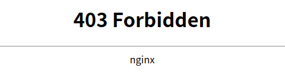

nginx配置文件中valid_referers字段作用及其配置。

### 背景
新装完一台服务器，从浏览器访问服务，进入了如下页面  
  
登录页都进不去，看样子是nginx配置出了问题，登录服务器查看配置文件

### 配置文件
配置文件中对应的url下有这么一段
```
    if ($invalid_referer) {
           return 403 ;
     }
```
看样子应该就是这一段的问题，全局搜invalid_referer，没有找到这个变量的定义，应该是
nginx自身的变量。

### 查找资料
查阅nginx官方文档[invalid_referer](https://nginx.org/en/docs/http/ngx_http_referer_module.html#var_invalid_referer),
invalid_referer这个变量与valid_referers这个配置协同工作，示例配置如下：
```
valid_referers none blocked server_names
               *.example.com example.* www.example.org/galleries/
               ~\.google\.;

if ($invalid_referer) {
    return 403;
}
```
配置了valid_referers后，浏览器请求中的refer字段如果匹配到了valid_referers中的配置，invalid_referer变量会
被设为空字符串，否则被设为1。匹配忽略大小写。

valid_referers可选取值及含义如下：
```
Syntax:	valid_referers none | blocked | server_names | string ...
```
+ none
    > 允许请求头中不存在Refer这个header
+ blocked
    > Refer存在于请求头中，但是值在经过防火墙或者Proxy时被删掉了
+ server_names
    > 如果Refer的域名与server_names某个域名匹配，则允许通过
+ 字符串
    > 域名或者url的字符串，可以用*匹配前缀或者后缀
+ 正则表达式
    > 使用正则表达式匹配，正则表达式需要以~开头，需要注意正则表达式只匹配http://或https://之后的内容

### 回到问题
查看valid_referers配置，发现配置为block，而浏览器直接访问主页时没有Refer这个header。
因此配置中加入none解决问题。或者直接将valid_referers字段和对invalid_referer的判断去掉也可以。