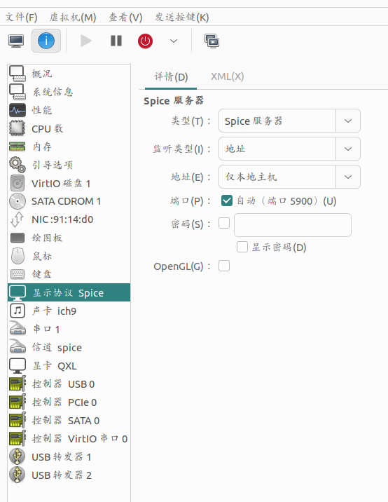

日常开发使用linux，但是某些软件（微信）对linux支持很差，使用wine安装后体验也不好，解决办法就是用kvm安装一个windows虚拟机，专门用来运行这些软件，一般给虚拟机分配2g内存就够了，kvm安装这里就不再过多介绍，简单搜索一下即可。这里介绍一些虚拟机和宿主机之间数据共享的问题，优化使用体验。

## 文件共享
文件共享只需要在linux开启一个smb或者ftp服务器，windows开启网络映射磁盘即可，ftp服务器搭建其他文章有介绍过

## 剪切板共享
重头戏，剪切板共享

1.guest安装spice-guest-tools,安装完成后关闭虚拟机，将虚拟机的显示协议改为spice


2.宿主机安装spice-vdagent(ubuntu)
```shell
$ sudo apt install spice-vdagent
```
安装完成后systemctl启动服务
```shell
$ sudo systemctl start spice-vdagentd
```
如果要自动启动，执行如下命令注册为服务
```shell
$ sudo systemctl enable spice-vdagentd
```
如果类似于如下报错
> The unit files have no installation config (WantedBy, RequiredBy, Also, Alias
> settings in the [Install] section, and DefaultInstance for template units).
> This means they are not meant to be enabled using systemctl
使用systemctl status spice-vdagentd确认service文件位置，将最后的Install部分修改为
```
[Install]
Also=spice-vdagentd.socket
```
> 如果还是不行，那就把systemctl start spice-vdagentd命令加入启动项

之后启动虚拟机，尝试下复制粘贴是否可以使用

## 虚拟机磁盘扩容
虚拟机偶尔会运行一段时间后发现磁盘不足需要扩容，按如下操作

#### 关闭虚拟机，找到虚拟机对应的磁盘文件

```shell
$ sudo virsh list

 Id   Name     State
------------------------
 2    win8.1   running

$ sudo virsh domblklist win8.1

 Target   Source
------------------------------------------------------------------------
 vda      /var/lib/libvirt/images/win8.1.qcow2
 sdb      /home/user/Downloads/Win10_22H2_Chinese_Simplified_x64v1.iso
```

#### 查看磁盘文件信息并扩容

```shell
$ sudo qemu-img info /your/disk/path
$ sudo qemu-img resize /your/disk/path +10G
```
> 如果虚拟机有snapshot则无法扩容，需要先将这些snapshot删掉

或者使用virsh自己的扩容命令， 与qume-img命令需要关闭虚拟机不同，这个命令需要虚拟机在运行状态
```shell
$ sudo virsh start $vm-name
$ sudo virsh blockresize $vm-name /your/disk/path 40G
```
与qemu-img不同，virsh指定扩容后磁盘总大小，qemu-img指定磁盘增长多大。

#### 开启虚拟机，使用磁盘分区工具管理扩容的空间
